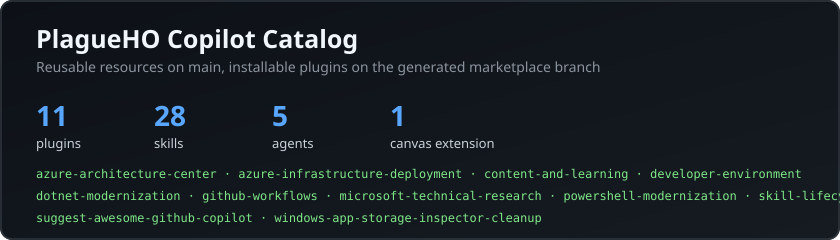

# PlagueHO Copilot Catalog

This repository contains Daniel Scott-Raynsford's curated GitHub Copilot plugins, reusable skills, custom agents, and canvas extensions. Resources that prove broadly useful are contributed upstream to [github/awesome-copilot](https://github.com/github/awesome-copilot).

<p align="center">
  
</p>

## Catalog

| Plugin | Description |
|--------|-------------|
| [azure-architecture-center](plugins/azure-architecture-center/) | Review and maintain Azure Architecture Center multitenant guidance. |
| [azure-infrastructure-deployment](plugins/azure-infrastructure-deployment/) | Provision Azure identities and update Azure Verified Modules. |
| [content-and-learning](plugins/content-and-learning/) | Review AI content readiness and create learning pathways. |
| [developer-environment](plugins/developer-environment/) | Scaffold dotfiles repositories and synchronize VS Code profiles. |
| [dotnet-modernization](plugins/dotnet-modernization/) | Convert legacy .NET projects to SDK style. |
| [github-workflows](plugins/github-workflows/) | Evaluate reviews, manage Dependabot PRs, optimize Copilot resources, and generate release content. |
| [microsoft-technical-research](plugins/microsoft-technical-research/) | Orchestrate structured Microsoft technical research with custom agents. |
| [powershell-modernization](plugins/powershell-modernization/) | Migrate Pester v4 tests to Pester v5. |
| [skill-lifecycle](plugins/skill-lifecycle/) | Create and convert agent skills. |
| [suggest-awesome-github-copilot](plugins/suggest-awesome-github-copilot/) | Discover resources from the awesome-copilot catalog. |
| [windows-app-storage-inspector-cleanup](plugins/windows-app-storage-inspector-cleanup/) | Inspect Windows application storage and safely recycle approved cleanup items. |

Browse the shareable catalog at [plagueho.github.io/plagueho.copilot](https://plagueho.github.io/plagueho.copilot/).

## Install the Marketplace

### VS Code

[](vscode://settings/chat.plugins.marketplaces?install-extension=PlagueHO/plagueho.copilot%23marketplace)
[](vscode-insiders://settings/chat.plugins.marketplaces?install-extension=PlagueHO/plagueho.copilot%23marketplace)

Or add the repository to `settings.json`:

```jsonc
{
  "chat.plugins.enabled": true,
  "chat.plugins.marketplaces": ["PlagueHO/plagueho.copilot#marketplace"]
}
```

The `#marketplace` suffix tells VS Code to use the generated distribution
branch rather than `main`, which is source-only. The installable plugin folders
are generated on the `marketplace` branch by the publish workflow. For a local
checkout, materialize the plugins before adding the folder as a local
marketplace:

```powershell
pnpm install
pnpm plugin:validate
pnpm plugin:materialize
```

After materialization, each plugin's `skills/` folder contains the referenced
skill directory and its `SKILL.md` file. Materialization updates the local
`plugins/` folders in place, so use a disposable checkout or restore the
source-only checkout from `main` before making source changes.

### GitHub Copilot CLI

```text
/plugin marketplace add PlagueHO/plagueho.copilot#marketplace
/plugin install <plugin>@plagueho-copilot
```

### Canvas Extensions

Canvas extensions are supported in the GitHub Copilot app. Install the Windows App Storage Inspector from Copilot:

```text
copilot plugin install windows-app-storage-inspector-cleanup@plagueho-copilot
```

## Source and Publishing Model

Human-maintained reusable resources live on `main`:

```text
agents/                         # Reusable custom agents
extensions/                     # Reusable canvas extension sources
skills/                         # Reusable agent skills
plugins/<plugin>/plugin.json    # Agent Plugins 1.0.0 metadata and composition
tests/<skill>/                  # Skill trigger tests
eng/                            # Validation, generation, and materialization
website/                        # GitHub Pages catalog
```

Plugin manifests reference reusable sources through `extensions["com.github.plagueho"]`. The publish workflow copies those sources into conventional plugin folders, removes the private composition metadata, and updates the generated `marketplace` branch. Do not edit that branch directly.

## Local Validation

```bash
pnpm install
pnpm plugin:validate
pnpm test
pnpm lint:md
npm --prefix website install
node website/build.mjs
npm --prefix website run build
```

## Contributing

See [CONTRIBUTING.md](CONTRIBUTING.md) for the resource and extension contribution workflows.

## Migration to Version 3

Marketplace version `3.0.0` renames the repository from `plagueho.skills` to `plagueho.copilot` and the marketplace identifier from `plagueho-agent-skills` to `plagueho-copilot`. GitHub redirects old repository URLs, but existing marketplace configuration and plugin install commands should be updated to the new names.

## License

See [LICENSE](LICENSE).
